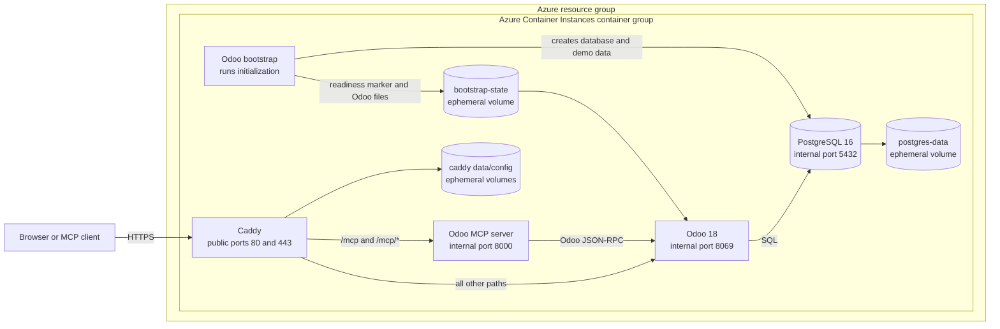

# Disposable Odoo ERP/CRM MCP demo on Azure

This project creates a ready-to-use Odoo business demo in Azure. It includes a website with realistic sample customers, products, sales orders, and CRM opportunities, plus an MCP connection that lets an AI agent work with that data. Everything runs in one temporary Azure environment, and the deployment prints the links and sign-in details when it is ready.

The environment is intended for workshops and demonstrations. Its data and generated credentials are disposable and must not be used for production.

## Deploy from Azure Cloud Shell

### 1. Open Cloud Shell

1. Open [Azure Cloud Shell](https://shell.azure.com/).
2. Sign in with the Azure account that owns the subscription you want to use.
3. Select **Bash** when prompted.
4. If this is your first Cloud Shell session, follow the prompt to create or attach its storage.

### 2. Download the project

Run the following commands:

```bash
git clone https://github.com/koenraadhaedens/azd-erp-crm-odoo-mcp-demo.git
cd azd-erp-crm-odoo-mcp-demo
```

### 3. Sign in to Azure Developer CLI

Cloud Shell is already signed in to Azure CLI. Azure Developer CLI uses its own sign-in, so start the device-code flow:

```bash
azd auth login --use-device-code
```

Open the displayed sign-in link, enter the code, and complete authentication with the same Azure account.

### 4. Deploy the demo

```bash
azd up
```

When prompted:

1. Enter a short environment name, such as `odoo-demo`.
2. Select the Azure subscription to use.
3. Select an Azure region that supports Azure Container Instances.

Deployment normally takes several minutes. The final step waits for Odoo to install its applications and load the realistic demo data; this can take up to 20 minutes.

### 5. Save the delivery information

When deployment finishes, the output displays:

- The Odoo website URL.
- The Odoo web login and password.
- The MCP URL and API key.
- Links to the deployed Azure resources.

These are generated demo credentials. Do not publish them or reuse them elsewhere. If the initial HTTPS certificate is still being issued, wait briefly and reload the Odoo URL.

Continue with the [Copilot Studio demo guide](demo-guide.md) to preview the Odoo CRM pipeline and connect the MCP server to an agent.

### Remove the demo

Return to the same Cloud Shell directory and run:

```bash
azd down --purge
```

Review the resources listed by the command and confirm their deletion. Removing the resource group permanently deletes the demo database, files, certificates, and generated credentials.

## Technical architecture

The Bicep templates deploy one Linux Azure Container Instances container group named `aci-<environment-name>` into a resource group named `rg-<environment-name>`. The group contains five containers built from four images.



Only Caddy exposes public ports. PostgreSQL, Odoo, and the MCP server communicate through the container group's shared loopback network and have no direct public ACI port mappings.

### Containers

| Container | Purpose | Requested resources |
| --- | --- | ---: |
| `postgres` | Runs the disposable Odoo PostgreSQL database. | 1 vCPU, 1 GB |
| `odoo-bootstrap` | Installs Odoo applications, loads demo data, rotates the administrator password, and then exits. | 1 vCPU, 2 GB |
| `odoo` | Serves the Odoo website and backend after bootstrap completes. | 1 vCPU, 2 GB |
| `mcp-server` | Exposes bounded, bearer-authenticated tools for Odoo CRM and sales operations. | 1 vCPU, 1 GB |
| `caddy` | Terminates HTTPS and routes public requests to Odoo or MCP. | 1 vCPU, 1 GB |

### Initialization and data lifecycle

1. PostgreSQL starts with an empty data directory.
2. The bootstrap container waits for PostgreSQL and creates the `odoo_demo` database.
3. It installs the CRM, sales, purchase, inventory, accounting, project, HR, maintenance, fleet, manufacturing, website/e-commerce, and point-of-sale applications.
4. It creates a connected Contoso scenario containing customers, vendors, products, inventory, opportunities, quotations, orders, projects, employees, and other operational records.
5. It writes a readiness marker and generated Odoo files to the shared `bootstrap-state` volume.
6. The Odoo web container detects the marker and starts. The MCP server then accesses Odoo over JSON-RPC.
7. Caddy obtains a certificate for the generated `*.azurecontainer.io` hostname and serves the public HTTPS endpoints.

All volumes use ACI `emptyDir` storage. Replacing or deleting the container group therefore deletes the database, Odoo files, readiness state, and cached TLS certificates.

### Public endpoints and routing

The deployment uses one generated ACI hostname:

- `https://<generated-name>.<region>.azurecontainer.io/` opens the Odoo website.
- `https://<generated-name>.<region>.azurecontainer.io/web` opens the Odoo backend login.
- `https://<generated-name>.<region>.azurecontainer.io/mcp` exposes the Streamable HTTP MCP endpoint.
- `https://<generated-name>.<region>.azurecontainer.io/health` exposes the public MCP health check.

Caddy routes `/mcp` and `/mcp/*` to the MCP server without removing the path. All other requests go to Odoo. Port 80 supports certificate validation and redirects normal requests to HTTPS.

MCP clients must send the generated key as a bearer token:

```http
Authorization: Bearer <MCP_API_KEY>
```

The MCP server provides bounded tools for health checks, contact search and creation, CRM lead search and creation, product search, and sales-order listing. It does not expose arbitrary Odoo models or methods. See [the MCP server documentation](src/odoo-mcp/README.md) for the environment contract and complete tool list.

### Container images

Normal deployments use anonymously available images from `acrdefcontainer.azurecr.io`:

| Image | Source in this repository |
| --- | --- |
| `odoo:18.0` | `src/odoo` |
| `postgres:16` | `src/postgres` |
| `odoo-mcp:latest` | `src/odoo-mcp` |
| `caddy-odoo:latest` | `src/caddy` |

The bootstrap container reuses the Odoo image. The deterministic seed script is embedded into the generated deployment command by Bicep, so the normal deployment does not require a custom Odoo image containing that script.

Set `BUILD_IMAGES=true` only when signed in to the image registry's tenant with permission to queue Azure Container Registry builds. Image locations can also be overridden through the `ODOO_IMAGE`, `POSTGRES_IMAGE`, `MCP_IMAGE`, and `CADDY_IMAGE` Azure Developer CLI environment values.

## Security limitations

This repository deliberately favors a quick, repeatable demo over production durability and isolation:

- Generated web, database, and MCP credentials are shown in deployment output and stored in local Azure Developer CLI environment state.
- All MCP callers share one static bearer key.
- PostgreSQL and application files use ephemeral storage without backups.
- Caddy stores certificates in an ephemeral group volume.
- The container group has no per-user authorization, private network, audit pipeline, or rate limiting.

A production design should use Microsoft Entra ID, managed identities, Azure Key Vault, durable managed database and storage services, private networking, managed ingress, backups, monitoring, and operation-level authorization. Avoid retaining deployment logs or sharing a screen while the generated credentials are visible.

## License

Except where otherwise noted, the original source code in this repository is licensed under the [MIT License](LICENSE).

The custom Odoo addon under `src/odoo/addons/realistic_demo` is licensed under LGPL-3.0-only. Odoo, PostgreSQL, Caddy, Python, container base images, and other third-party dependencies remain subject to their respective licenses and trademark policies.
