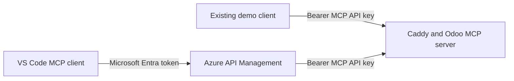

# Demo: Use the Entra-protected Odoo MCP server

The repository deployment creates an Azure API Management instance, an environment-specific Microsoft Entra application, and an identity-aware passthrough to the Odoo MCP server. This guide connects VS Code to that deployed endpoint.

The two paths continue to work side by side:

| Path | Client authentication | Backend authentication |
| --- | --- | --- |
| Existing direct MCP URL | Generated static bearer key | Generated static bearer key |
| Additional API Management URL | Microsoft Entra ID OAuth token | API Management injects the existing static bearer key |



> This remains a disposable demonstration. API Management doesn't make the ephemeral Odoo deployment production ready. The direct endpoint also remains reachable by design.

## 1. Prerequisites

You need:

- A completed deployment of this repository.
- The `MCP URL` and `API key` printed by the existing deployment.
- Permission to create a Developer-tier API Management instance.
- Permission to create a Microsoft Entra app registration, or an existing app client ID supplied as `ENTRA_APP_CLIENT_ID` before deployment.
- A recent version of Visual Studio Code with GitHub Copilot and remote MCP OAuth support.

Record these values before starting:

| Name | Example |
| --- | --- |
| Tenant ID | `00000000-0000-0000-0000-000000000000` |
| API Management gateway URL | The `APIM_GATEWAY_URL` deployment output |
| Entra application client ID | The `ENTRA_APP_CLIENT_ID` azd environment value |
| Existing MCP URL | `https://<generated-name>.<region>.azurecontainer.io/mcp/` |
| Existing MCP API key | `Mcp-<generated-value>!` |

Use these names in the walkthrough:

| Item | Value |
| --- | --- |
| Entra app display name | `Odoo MCP APIM demo` |
| API Management MCP name and base path | `odoo-mcp` |
| OAuth scope | `mcp.access` |
| Secret named value | `odoo-mcp-backend-authorization` |

The resulting client endpoint is:

```text
https://<apim-name>.azure-api.net/odoo-mcp/mcp
```

## 2. Verify the existing MCP endpoint

Open the existing health endpoint by replacing `/mcp/` in the direct MCP URL with `/health`:

```text
https://<generated-name>.<region>.azurecontainer.io/health
```

Expected response:

```json
{
  "status": "ok",
  "service": "odoo-mcp"
}
```

Don't continue until the existing endpoint is healthy. The same `azd up` deployment provisions the API Management service and its policies.

## 3. Automatic provisioning

The pre-provision hook creates or reuses the environment-specific Entra app, configures its `mcp.access` scope and public-client redirect URI, and saves its client ID in the azd environment. Bicep then deploys API Management, the MCP passthrough, backend authorization named value, validation policy, and protected-resource metadata endpoint.

Retrieve the values at any time:

```bash
azd env get-value APIM_MCP_URL
azd env get-value APIM_PROTECTED_RESOURCE_URL
azd env get-value ENTRA_APP_CLIENT_ID
```

Skip to **Add the API Management endpoint manually in VS Code**. The following sections are retained only as a manual configuration reference.

## 4. Manual fallback: Register the protected API in Microsoft Entra ID

1. Open the [Microsoft Entra admin center](https://entra.microsoft.com/).
2. Go to **Identity** > **Applications** > **App registrations**.
3. Select **New registration**.
4. Enter `Odoo MCP APIM demo`.
5. Select **Accounts in this organizational directory only**.
6. Leave the redirect URI empty and create the registration.
7. Copy the **Application (client) ID** and **Directory (tenant) ID**.
8. Open **Expose an API**.
9. Set the Application ID URI to the suggested value:

   ```text
   api://<application-client-id>
   ```

10. Select **Add a scope** and create this delegated scope:

    | Setting | Value |
    | --- | --- |
    | Scope name | `mcp.access` |
    | Who can consent | Admins and users |
    | Admin consent display name | `Access the Odoo MCP demo` |
    | Admin consent description | `Allow this client to access the Odoo MCP demo through API Management.` |
    | User consent display name | `Access the Odoo MCP demo` |
    | User consent description | `Allow this application to access the Odoo MCP demo on your behalf.` |
    | State | Enabled |

11. Open **Authentication** and select **Add a platform**.
12. Select **Mobile and desktop applications**.
13. Add this custom redirect URI:

    ```text
    http://localhost
    ```

14. Under **Advanced settings**, set **Allow public client flows** to **Yes** and save.

This single app registration represents the protected API and supplies the public client ID used by VS Code for this demo. It doesn't need a client secret.

## 5. Manual fallback: Store the backend bearer key in API Management

The MCP client must never receive the static backend key. Store it as a secret named value that only the API Management policy uses.

1. Open the existing API Management instance in the Azure portal.
2. Go to **APIs** > **Named values**.
3. Select **Add**.
4. Enter these values:

   | Setting | Value |
   | --- | --- |
   | Display name | `Odoo MCP backend authorization` |
   | Name | `odoo-mcp-backend-authorization` |
   | Value | `Bearer Mcp-<generated-value>!` |
   | Secret | Yes |

5. Save the named value.

Include `Bearer` and one space in the value. Don't enter only the generated key.

> For a production design, use an Azure Key Vault-backed named value and rotate the backend credential. A secret named value is sufficient for this disposable demo.

## 6. Manual fallback: Add the existing MCP server to API Management

1. In the API Management instance, go to **APIs** > **MCP servers**.
2. Select **+ Create MCP server**.
3. Select **Expose an existing MCP server**.
4. For the backend MCP server URL, enter the existing direct MCP URL exactly, including `/mcp/`.
5. Keep **Streamable HTTP** as the transport.
6. Set the display name to `Odoo ERP CRM MCP`.
7. Set the name and base path to `odoo-mcp`.
8. Enter a description such as `Entra-protected passthrough to the disposable Odoo MCP demo.`
9. Don't associate the MCP server with a product that requires a subscription key. This demo uses Entra ID instead of an API Management subscription key.
10. Create the MCP server.

The API Management server URL should be:

```text
https://<apim-name>.azure-api.net/odoo-mcp/mcp
```

## 7. Manual fallback: Apply Entra validation and backend-key injection

Open the newly created MCP server, select **Policies**, and replace the policy with the following XML. Replace all four placeholders before saving:

- `YOUR_TENANT_ID`
- `YOUR_APPLICATION_CLIENT_ID`
- `YOUR_APIM_GATEWAY_HOST`, for example `contoso-apim.azure-api.net`
- If a different MCP base path was used, replace `odoo-mcp`

```xml
<policies>
  <inbound>
    <base />
    <validate-azure-ad-token
        tenant-id="YOUR_TENANT_ID"
        header-name="Authorization"
        failed-validation-httpcode="401"
        failed-validation-error-message="Unauthorized">
      <audiences>
        <audience>YOUR_APPLICATION_CLIENT_ID</audience>
        <audience>api://YOUR_APPLICATION_CLIENT_ID</audience>
      </audiences>
      <required-claims>
        <claim name="scp" match="any" separator=" ">
          <value>mcp.access</value>
        </claim>
      </required-claims>
    </validate-azure-ad-token>
    <rate-limit-by-key
        calls="60"
        renewal-period="60"
        counter-key="@(context.Request.IpAddress)" />
    <set-header name="Authorization" exists-action="override">
      <value>{{odoo-mcp-backend-authorization}}</value>
    </set-header>
  </inbound>
  <backend>
    <forward-request />
  </backend>
  <outbound>
    <base />
  </outbound>
  <on-error>
    <base />
    <choose>
      <when condition="@(context.Response.StatusCode == 401)">
        <return-response>
          <set-status code="401" reason="Unauthorized" />
          <set-header name="WWW-Authenticate" exists-action="override">
            <value>Bearer error="invalid_token", resource_metadata="https://YOUR_APIM_GATEWAY_HOST/.well-known/oauth-protected-resource/odoo-mcp/mcp"</value>
          </set-header>
        </return-response>
      </when>
    </choose>
  </on-error>
</policies>
```

Policy order matters: API Management first validates the caller's Entra token and scope, then overwrites `Authorization` with the static bearer key expected by the existing backend.

Don't log or read `context.Response.Body` in an MCP policy. Response buffering can interfere with Streamable HTTP.

## 8. Manual fallback: Add the OAuth protected-resource metadata endpoint

VS Code needs Protected Resource Metadata to discover the Microsoft Entra authorization server and requested scope.

### Create the metadata API

1. In API Management, go to **APIs** > **APIs**.
2. Select **+ Add API** > **HTTP**.
3. Enter these values:

   | Setting | Value |
   | --- | --- |
   | Display name | `Odoo MCP OAuth metadata` |
   | Name | `odoo-mcp-oauth-metadata` |
   | Web service URL | `https://YOUR_APIM_GATEWAY_HOST` |
   | API URL suffix | `.well-known/oauth-protected-resource` |
   | Subscription required | No |

4. Create the API.
5. Add a `GET` operation with display name `Get Odoo MCP protected resource metadata` and URL template:

   ```text
   /odoo-mcp/mcp
   ```

The public metadata URL is now:

```text
https://YOUR_APIM_GATEWAY_HOST/.well-known/oauth-protected-resource/odoo-mcp/mcp
```

### Apply the metadata policy

Open the `GET` operation's policy editor and use this policy. Replace the tenant ID, application client ID, and gateway host placeholders.

```xml
<policies>
  <inbound>
    <return-response>
      <set-status code="200" reason="OK" />
      <set-header name="Content-Type" exists-action="override">
        <value>application/json</value>
      </set-header>
      <set-header name="Cache-Control" exists-action="override">
        <value>public, max-age=3600</value>
      </set-header>
      <set-body>@{
        return Newtonsoft.Json.JsonConvert.SerializeObject(new {
          resource = "https://YOUR_APIM_GATEWAY_HOST/odoo-mcp/mcp",
          authorization_servers = new[] {
            "https://login.microsoftonline.com/YOUR_TENANT_ID/v2.0"
          },
          bearer_methods_supported = new[] { "header" },
          scopes_supported = new[] {
            "api://YOUR_APPLICATION_CLIENT_ID/mcp.access"
          }
        });
      }</set-body>
    </return-response>
  </inbound>
  <backend>
    <base />
  </backend>
  <outbound>
    <base />
  </outbound>
  <on-error>
    <base />
  </on-error>
</policies>
```

Browse to the metadata URL and confirm that it returns JSON. Verify that:

- `resource` exactly matches the API Management MCP URL used by the client.
- `authorization_servers` contains the correct tenant.
- `scopes_supported` contains the complete exposed scope.

## 9. Add the API Management endpoint manually in VS Code

1. Open the Command Palette in VS Code.
2. Run **MCP: Add Server**.
3. Select **HTTP (HTTP or Server Sent Events)**.
4. Enter the API Management MCP URL:

   ```text
   https://YOUR_APIM_GATEWAY_HOST/odoo-mcp/mcp
   ```

5. Use `odooErpCrmViaApim` as the server ID.
6. Save it to the user profile or a test workspace.
7. Open the generated MCP configuration and add the `oauth` block so the server entry is:

```json
{
  "servers": {
    "odooErpCrmViaApim": {
      "type": "http",
      "url": "https://YOUR_APIM_GATEWAY_HOST/odoo-mcp/mcp",
      "oauth": {
        "clientId": "YOUR_APPLICATION_CLIENT_ID"
      }
    }
  }
}
```

1. Start or restart the server.
2. Approve the server trust prompt.
3. Complete the Microsoft sign-in and consent flow in the browser.
4. In Copilot Chat, open **Configure Tools** and enable the Odoo tools from `odooErpCrmViaApim`.

Don't add `MCP_API_KEY`, `Authorization`, or an API Management subscription key to this client configuration. VS Code obtains the Entra token; API Management supplies the backend key.

## 10. Test the additional path

Use these prompts in a new Copilot Chat agent session:

```text
Use the API Management Odoo tools to check whether Odoo is available.
```

```text
Use the API Management Odoo tools to find Azure Peak Bikes and summarize its CRM opportunities.
```

Expected request flow:

1. VS Code sends an Entra access token to API Management.
2. API Management validates the token audience and `mcp.access` scope.
3. API Management replaces the Entra token with the secret backend bearer key.
4. The unchanged Odoo MCP server authenticates the backend request and invokes the selected tool.

Also verify both negative cases:

- Open the API Management MCP URL without signing in: expect `401 Unauthorized` with a `WWW-Authenticate` header containing `resource_metadata`.
- Send an Entra token without the `mcp.access` scope: expect `401 Unauthorized`.

Finally, verify that the original direct MCP URL still works with its generated API key. This confirms that the additional demo didn't alter the original path.

## Troubleshooting

### VS Code doesn't open the sign-in page

- Confirm that the server entry contains the `oauth.clientId` property.
- Open the protected-resource metadata URL directly and validate its JSON.
- Confirm that the `resource_metadata` URL in the `WWW-Authenticate` response is reachable anonymously.
- Run **MCP: List Servers**, select the server, and inspect its output.
- Restart the MCP server after changing metadata or OAuth configuration.

### Entra returns a redirect URI error

Confirm that the app registration has the **Mobile and desktop applications** platform, the `http://localhost` redirect URI, and public client flows enabled.

### API Management returns 401 after sign-in

Decode the access token with a trusted local tool and verify:

- `tid` matches the configured tenant.
- `aud` is the application client ID or its Application ID URI.
- `scp` contains `mcp.access`.

Don't paste a real demo token into a public website or support request.

### The backend returns 401

Confirm that the secret named value includes the exact prefix and spacing:

```text
Bearer Mcp-<generated-value>!
```

Confirm that the policy's `set-header` runs after `validate-azure-ad-token` and references `{{odoo-mcp-backend-authorization}}`.

### MCP requests fail or streaming stops

- Confirm that the APIM backend uses the existing `/mcp/` Streamable HTTP endpoint.
- Don't access the response body from a policy.
- If global API Management diagnostics are enabled, set frontend response payload logging to zero bytes for MCP traffic.

## Remove the demo

Run `azd down --purge` to remove the resource group, including API Management and the Odoo container group. Microsoft Entra applications are tenant objects rather than resource-group resources, so also delete:

1. The `Odoo MCP APIM demo - <environment-name>` Entra app registration if the deployment created it.
2. The `odooErpCrmViaApim` entry from the VS Code MCP configuration.

## Security notes

- The backend API key remains a shared credential and the direct endpoint remains public.
- This guide doesn't add private networking, operation-level roles, durable storage, auditing, or automatic backend-key rotation.
- For production, use private backend connectivity, Key Vault-backed secrets, least-privilege app roles or scopes, Conditional Access as appropriate, monitored APIM diagnostics, and an explicit credential-rotation process.

References:

- [Connect and govern an existing MCP server with API Management](https://learn.microsoft.com/azure/api-management/expose-existing-mcp-server)
- [Secure access to MCP servers in API Management](https://learn.microsoft.com/azure/api-management/secure-mcp-servers)
- [Manage MCP servers programmatically](https://learn.microsoft.com/azure/api-management/manage-mcp-servers-rest-api)
- [VS Code MCP configuration reference](https://code.visualstudio.com/docs/agents/reference/mcp-configuration)
- [OAuth 2.0 Protected Resource Metadata](https://datatracker.ietf.org/doc/html/rfc9728)
